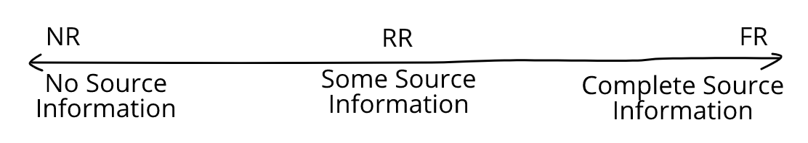

In this post, we will introduce two broad categories of image/video quality models, and discuss two algorithms that fall under a third, hybrid, category. We will heavily borrow from concepts of Natural Scene Statics (NSS) and Information theory discussed in my earlier post on [VIF](post/nss-and-vif).

Consider the following scenario. You go on a hike and come back with a collection of high-quality pictures on your favourite DSLR camera. You now want to share these pictures, but the "raw" files on your camera are massive. So, you need to compress them, which leads to some data loss, changing the image ever so slightly. We want to measure how this "distortion" affects the quality of the image. We can ask this question in two ways. 

You hold the original "pristine" image and this compressed image side by side and compare them. This way, you will be able to identify exactly where the image has been changed, and by how much. Or, as in our case, you could use an algorithm which takes both the pristine image, called the reference, and the compressed image, called the test image, and predicts how good/poor you perceive the compressed image to be. This is called a Full Reference (FR) quality metric because it compares the test image against a gold-standard reference image.

Another way one could ask this question is to only consider the compressed image. Instead of measuring the change due to compression, we only predict how good the final product looks. Because we do not compare the test image with any gold-standard, we call this a No Reference (NR) quality model. In the case of compression, this does not seem like a great idea because we are ignoring information about the gold standard even though we have access to it.

However, NR models are very useful in other settings where a pristine image/video does not exist. The most important use of NR models is in estimating the quality of User Generated Content (UGC). While large studios create movies and advertisements with professional camera work and editing, a large volume of content on the internet is created by individuals, often with hand-held cameras. Such images/videos often suffer from degradations like noise, blur, low exposure. So, even though there is no "gold standard" to compare against, it is clear that such videos are of poor quality. NR models help us capture exactly that.

Naturally, because have access to more information, FR models typically predict subjective quality better than NR models. But, we are not restricted to this all-or-nothing binary. For example, let us consider the case of transmitting a video over a lossy network. As the service provider, we would like to measure the quality of the video at the user's end.

Of course, we cannot use an FR model. If we could have a copy of the pristine video at the user's end, we could declare victory and move on. On the other hand, no reference models do not perform very well. So, we find a middle ground. We can transmit _some_ side information about the pristine video over the network and use this to calculate quality. Such models are called reduced-reference (RR) models and they occupy the region between FR and NR models.

Now that we know what a RR algorithm should look like, let us discuss the first of two very similar algorithms - Spatio-Temporal Reduced Reference Entropic Differencing (ST-RRED) [1]. As in [VIF](post/nss-and-vif) [2], this model also uses the Gaussian Scale Mixture (GSM) to model the statistics of wavelet coefficients. However, this model deviates from VIF in two important ways. First, instead of modelling a distortion channel, frames from both the reference and the test videos are modelled as GSM random vectors (RVs). This is because modelling the distortion channel requires both reference and test data, which is only possible in an FR setting. Secondly, ST-RRED extends the statistical model to the temporal dimension by using GSM to also model the statistics of frame differences. This allows the model to determine both the spatial and temporal quality of videos.

The following few paragraphs contain some tedious notation but it will all be worth it in the end. We first consider corresponding frames from the reference and distorted videos and calculate their wavelet coefficients using the Steerable Pyramid [3] decomposition. Coefficients from each subband (corresponding to one scale and one orientation) are split into $M \times M$ blocks. Let us denote the $m^{th}$ coefficient in the $k^{th}$ subband of frame $f$ in the reference and distorted videos by $C_{mkfr}$ and $C_{mkfd}$ respectively. 

Because we model these coefficients as a GSM, we can express them as the product of a non-negative scalar random variable $S$ and a Gaussian RV $U$. That is,
$$ C_{mkfr} = S_{mkfr} U_{mkfr}, \ C_{mkfd} = S_{mkfd} U_{mkfd}$$

Similarly, to measure the temporal quality, we consider the wavelet coefficients of the differences between successive frames and model them also as GSM RVs.
$$ D_{mkfr} = T_{mkfr} V_{mkfr}, \ D_{mkfd} = T_{mkfd} V_{mkfd}$$

These are passed through an Additive White Gaussian Noise Channel (AWGN) which models neural noise in the Human Visual System (HVS) to get
$$C_{mkfr}' = C_{mkfr} + W_{mkfr}, \ C_{mkfd}' = C_{mkfd} + W_{mkfd}$$ $$D_{mkfr}' = D_{mkfr} + Z_{mkfr}, \ D_{mkfd}' = D_{mkfd} + Z_{mkfd}$$

where the noise RVs $W_{mkfr}$ and $W_{mkfd}$ are distributed as $\mathcal{N}(0, \sigma_w^2 I)$, and $Z_{mkfr}$ and $Z_{mkfd}$ are distributed as $\mathcal{N}(0, \sigma_z^2 I)$. 

As in VIF, we estimate the covariance of the "underlying" Gaussian in each case, denoting them by $K_{U_{kfr}}$, $K_{V_{kfd}}$, $ K_{V_{kfr}}$, and the value of the scalar multipliers at each point (also called the variance field), denoting them by $s_{mkfr}$, $s_{mkfd}$, $t_{mkfr}$, and $t_{mkfd}$.

Using these quantities, we can compute the conditional differential entropy of the $d = M^2$ dimensional GSM vectors $C$ and $D$ given $s$ and $t$ respectively as 
$$ h_{C_{mkfr}} = h\left(C_{mkfr} | S_{mkfr} = s_{mkfr}\right) = \frac{1}{2} \log\left[(2 \pi e)^d \left\lvert s_{mkfr}^2 K_{U_{kfr}} + \sigma_w^2I\right\rvert\right]$$ $$ h_{D_{mkfr}} = h\left(D_{mkfr} | T_{mkfr} = t_{mkfr}\right) = \frac{1}{2} \log\left[(2 \pi e)^d \left\lvert t_{mkfr}^2 K_{V_{kfr}} + \sigma_z^2I\right\rvert\right]$$

and similarly for coefficients from the test images. A weighting term is added to these entropy values, which assigns higher weights to regions having higher local variance. This is done because areas having higher spatial information (variance) are perceptually more important. The spatial and temporal scaling factors are computed from the local variance estimates as
$$\gamma_{mkfr} = \log\left(1 + s_{mkfr}^2\right)$$ $$\delta_{mkfr} = \log\left(1 + s_{mkfr}^2\right)\log\left(1 + t_{mkfr}^2\right)$$

and similarly in the distorted coefficients. The Spatial RRED index for a video having $F$ frames, in subband $k$, which has $M_k$ samples is defined as the average difference between weighted entropies
$$ SRRED_{k}^{M_k} = \frac{1}{F M_k} \sum_{f=1}^{F}\sum_{m=1}^{M_k} \lvert \gamma_{mkfr} h_{C_{mkfr}} - \gamma_{mkfd} h_{C_{mkfd}} \rvert$$

Note that to calculate this, all $M_k$ values of $\gamma_{mkfr} h_{C_{mkfr}}$ must be available. This is effectively a FR model, because it has access to all the available information. However, we can reduce the number of scalars by summing up neighbouring values. As an extreme case, the SRRED index using just one scalar is obtained by summing up all the scalars in each subband, giving 
$$ SRRED_{k}^{1} = \frac{1}{F M_k} \sum_{f=1}^{F} \left\lvert \sum_{m=1}^{M_k} \gamma_{mkfr} h_{C_{mkfr}} - \sum_{m=1}^{M_k} \gamma_{mkfd} h_{C_{mkfd}} \right\rvert $$

We can choose to transmit any intermediate number of scalars, say $N$, by summing up $M_k/N$ neighbouring values

$$ SRRED_{k}^{N} = \frac{1}{F M_k} \sum_{f=1}^{F} \sum_{n=1}^{N} \left\lvert \sum_{m=\frac{(n-1)M_k}{N}}^{\frac{nM_k}{N}} \gamma_{mkfr} h_{C_{mkfr}} - \sum_{m=\frac{(n-1)M_k}{N}}^{\frac{nM_k}{N}} \gamma_{mkfd} h_{C_{mkfd}} \right\rvert $$

In exactly the same manner, we can define the temporal RRED index using $N$ scalars in the $k^{th}$ subband as
$$ TRRED_{k}^{N} = \frac{1}{F M_k} \sum_{f=1}^{F} \sum_{n=1}^{N} \left\lvert \sum_{m=\frac{(n-1)M_k}{N}}^{\frac{nM_k}{N}} \delta_{mkfr} h_{D_{mkfr}} - \sum_{m=\frac{(n-1)M_k}{N}}^{\frac{nM_k}{N}} \delta_{mkfd} h_{D_{mkfd}} \right\rvert $$

Finally, the STRRED index is obtained as the product
$$ STRRED_k = SRRED_k \cdot TRRED_k$$

So, we have developed an information-theoretic model of subjective quality, where the amount of information available at the receiver's end can be controlled by choosing the number of scalars to be transmitted. Accordingly, the performance of the quality model also varies. In their experiments, the authors showed that ST-RRED  reported higher performance than Multi-Scale SSIM (MS-SSIM) and PSNR using just 0.1\% of the number of scalars at the receiver.

The Spatial Efficient Entropic Differences (SpEED-QA) [4] model applies the same algorithm, but in the spatial domain. This is done by replacing the wavelet transform with a simple local mean subtraction. This significantly reduces the computational cost with a small decrease (sometimes increase!) in performance.

So, there we have it! By modelling reference and test images independently and comparing derived quantities, we can control the amount of information that is available at the receiver and leverage the resulting tradeoff.

# References
[1] Rajiv Soundararajan and Alan C. Bovik. Video Quality Assessment by Reduced Reference Spatio-Temporal Entropic Differencing. _IEEE Transactions on Circuits and Systems for Video Technology, 2013_ [Link](https://www.live.ece.utexas.edu/publications/2013/Rajiv%20%20Video-RRED%20Paper.pdf)

[2] Hamid R. Sheikh and Alan C. Bovik. Image Information and Visual Quality. _IEEE Transactions on Image Processing, 2006_ [Link](https://live.ece.utexas.edu/publications/2004/hrs_ieeetip_2004_imginfo.pdf)

[3] Eero P. Simoncelli and William T. Freeman. The Steerable Pyramid: A Flexible Architecture For Multi-Scale Derivative Computation. _IEEE Conference on Image Processing, 1995_ [Link](https://www.cns.nyu.edu/pub/eero/simoncelli95b.pdf)

[4] Christos G. Bampis, Praful Gupta, Rajiv Soundararajan and Alan C. Bovik. SpEED-QA: Spatial Efficient Entropic Differencing for Image and Video Quality. _IEEE Signal Processing Letters, 2017_ [Link](https://ieeexplore.ieee.org/document/7979533)