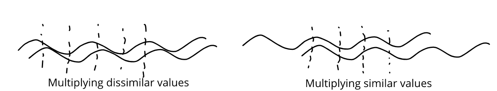

This article is a review of existing texture characterization, identification and segmentation methods. These methods typically involve statistical methods, i.e. inferring from histograms or co-occurrence matrices, and/or signal processing methods, either simple filtering and energy-based methods, or as a method of pre-processing before applying statistical analysis.

But, what is texture? Simply, ''texture'' describes the local arrangement of pixels/intensity values. For a classic example, consider two $8\times 8$ squares, one painted half white and half black, while the other has a checkerboard pattern. While they have the same mean luminance (brightness), they vary in the arrangement in the actual pixel (intensity) values. That is, they vary in ''texture''. 

Texture can also be thought of as local ''complexity''. The first square in our example had two plain regions, so it was ''simple'', while the checkerboard pattern is more ''complex''. Natural examples of texture include grass, fabric patterns, ripples, falling confetti, etc. Note that we have not rigorously defined the term yet. That is because texture is not a precisely defined concept, merely a notion. Even so, describing local arrangements can be very useful. Texture analysis has found great use in medical image processing, document processing and remote sensing. An example closer to my work would be that ''simple'' or ''plain'' regions can be compressed easily, while complex regions may demand higher bandwidth. 

What type of questions can we ask about texture? The simplest question is to identify it. Given a set of texture classes, can we identify a given texture as being one of these? This is called texture classification and typically involves statistical methods. Another task is texture segmentation, where we wish to segment (split) an image into regions having different textures from each other. Think of the Windows XP wallpaper, but without clouds and less tidy grass. Such a method would split the image into the sky and the grass because they have different textures.

We will now look at features that we can use to describe textures. Currently, I'm not interested in specific algorithms. My goal is to find ways to ''describe'' texture. This will also not be an exhaustive review of all texture features. After all, texture is not the focus of my work. Learning this is just the means to an end, so I will only go so far as I need to.

Most of my reading has used this presentation [1] and this review article [2] as jumping points to other sources wherever necessary.

# First-Order Statistical Features
Statistics that only depend on individual pixel values are called first-order statistics. The local range and variance are simple first-order statistical features to describe textures. Plain regions have a smaller range (max - min) while textured regions have larger ranges because of the greater diversity in intensity values. A similar argument can be made about local variances because of which we expect textured regions to have higher variance than plain regions.

# Gray Level Co-occurence Matrix (GLCM)
The Gray Level Co-occurence Matric (GLCM) is arguably the most common method of describing textures. The GLCM records second-order statistics, because it depends on pairs of pixels, storing information about the relative positions of pixels having similar intensity values. Given an offset  $\delta = (\delta x, \delta y)$ , the GLCM is a $256 \times 256$ matrix counting the co-occurence of gray levels at an offset  $ \delta $ . That is, we construct a matrix whose entries are
 $$ G_{\delta}[i,j] = \sum_x \sum_y \mathbb{1}(G[x,y] = i) \mathbb{1}(G[x+\delta y,y+\delta y] = j) $$ 

The entries of this matrix are then normalized by the sum of all entries, giving us a normalized GLCM, say  $ P_\delta $, which is a valid probability mass function. While the GLCM itself is not used to, say, compare textures, we derive numerical features from these which are used to describe texture. Some examples of such features are
* **Maximum** :  $ \max P_\delta[i,j] $ , i.e., the most likely pair of intensities.
* **Order $ k $ difference moment** : $ E[(i-j)^k] $ , or its inverse  $ E[1/(i-j)^k] $ . A special case of this is the contrast, which is the 2nd difference moment, i.e.,  $ E[(i-j)^2] $ .
* **Homogeneity**: $ E\left[\frac{1}{(1 + \lvert i-j\rvert)}\right] $ . A homogeneous image will have non-zero entries close to the principal diagonal, i.e  $ i \approx j $ , while a heterogeneous image will have a more even spread since many pairs occur.
* **Entropy**: $ E[-\log P_\delta[i,j]] $ , which is a measure of the ''spread'' or the amount of information in the distribution.
* **Correlation**: $ \frac{E[ij] - \mu_i\mu_j}{\sigma_i \sigma_j} $  which is high when pixels have a linear dependence.

Haralick [3] defined 14 texture features based on the GLCN. In a similar vein, the Gray Level Difference statistics (GLDS) are derived from a vector of 256 values, which count the number of times each difference  $ \lvert i-j\rvert $  occurs between pairs of intensity values separated by a distance  $ \delta $.

A main drawback of the GLCM and the GLDS is finding a good choice of  $ \delta $. In the current deep learning/gradient-based optimization era, I would add that the non-differentiability of the counting process is an added drawback.

# Autocorrelation Function
The autocorrelation function (ACF) is a powerful signal processing method to extract repeating patterns. Given an image  $ I(x,y) $,  the ACF is defined as 

$$ \rho(u,v) = \frac{\sum_x \sum_y I(x,y) I(x+u, y+v)}{\sum_x\sum_y I^2(x,y)} $$

The auto-correlation function is a function of the ''offset'' between pairs of pixels. Given an offset, we multiply corresponding intensity values and consider the normalized sum. Why is this relevant? When the offset is close to the ''true'' offset between similar texture elements, the value of the ACF is close to 1, which is its highest value. 

Why is this the case? The short technical answer is ''Cauchy-Schwarz Inequality''. More simply, we know that textures involve patterns which repeat at some intervals (although not exactly). So, it makes sense that we would like to ''test'' various offsets. When we choose the correct offset, the repeating intensities ''line up'', so they get squared in the summation, leading to an ACF value close to 1. When we choose an ''incorrect'' offset, the repeating values do not overlap, leading to lower values. The figure below shows a visual argument for why ''lining up'' is a good thing.

At this point, much like Dumbledore to Harry on the Astronomy Tower, I must ask for your trust in believing that squaring values when lining up is the ''best'' you can do (that is, lining up maximizes the ACF). Thankfully, you don't need to wait for the death of a morally grey character to find out why this is actually the case. There are elegant proofs of the Cauchy Schwarz inequality that I would encourage you to find online. Several proofs have been reviewed in [4].

Moving on, the ACF falls off slowly when the texture is coarse, because it takes a large shift to fall out of, or out of phase with, the texture. On the other hand, fine textures cause a sharp drop in the ACF.

# Signal Processing Methods
We begin with the simple observation that the coarseness of texture in a region is related to the density of edges in that region. Fine textures have a higher edge density compared to coarse textures. To extract these features we can use edge operators like the Laplacian operator. 

Another set of filters is used to calculate the  $ (p+q) $  th moment of an image region  $ \mathcal{R} $ 
$$  m_{p,q}(x,y) = \sum_{(u,v) \in \mathcal{R}} u^p v^q I(u,v)  $$ 

Choosing the region  $ \mathcal{R} $  to be a rectangular region, we can implement this as a linear filter having the appropriate weights.

Perceptually motivated methods use filters that better represent the preattentive perception in the Human Visual System (HVS). Gabor filters, which are complex exponentials having a Gaussian envelope, are a good model of simple cells in the primary visual cortex. Because these filters are both frequency and orientation-selective, they are used to conduct a multi-scale multi-orientation analysis of images.

To derive texture features, an image to passed through a Gabor filter bank to obtain subbands  $ r_i(x,y) $ . These responses are passed through a sigmoid non-linearity  $ \sigma $  (tanh function) and used to obtain texture features
\begin{equation}
    f_i(x,y) = \sum_{(u,v) \in \mathcal{R}} |\sigma(r_i(u,v))|
\end{equation}

Laws [5] proposed a computationally efficient method to compute texture energies using spatially separable filters. The method uses a set of Texture Energy Metric (TEM) vectors. The outer product of each pair of vectors results in a filter. The five types of vectors (corresponding to different textures) are level, edge, spot, wave and ripple. 
These TEM filters are used to filter images and compute the local texture energy, which is simply the sum of the magnitudes in a local region.

# References
[1] Micheal A. Wirth. Texture Analysis [Link](http://www.cyto.purdue.edu/cdroms/micro2/content/education/wirth06.pdf)

[2] Mihran Tuceryan and Anil K. Jain. Texture Analysis. _Handbook of Pattern Recognition and Computer Vision_ [Link](https://www.worldscientific.com/doi/abs/10.1142/9789814343138_0010)

[3] R. M. Haralick and K. Shanmugam and I. Dinstein. Textural Features for Image Classification. _IEEE Transactions on Systems, Man, and Cybernetics, 1973_ [Link](http://haralick.org/journals/TexturalFeatures.pdf)

[4] Hui-Hua Wu and Shanhe Wu. Various proofs of the Cauchy-Schwarz inequality. [Link](https://www.statisticshowto.com/wp-content/uploads/2016/06/Cauchy-Schwarzinequality.pdf)

[5] Kenneth I. Laws. Rapid Texture Identification. _Optics & Photonics, 1980_ [Link](https://www.spiedigitallibrary.org/conference-proceedings-of-spie/0238/0000/Rapid-Texture-Identification/10.1117/12.959169.short)