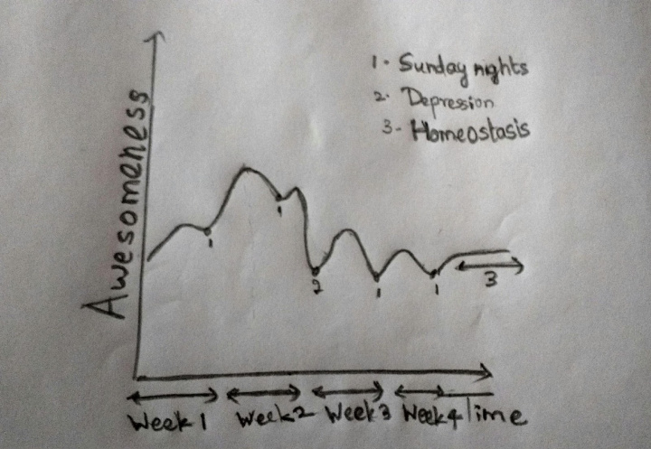

Because I’ve had a lot of people tell me the worst way to start an article is using a quote, I’m going to do just that.

“Everything good, everything magical happens between the months of June and August.” Now, before you think I’m some literary savant who knows all quotes by anybody famous, I’d like to confess that I Googled for this after I wrote down the title of the article. And I found it on Buzzfeed, not Goodreads; so you can imagine my literary inclinations. One of the things that struck me about it, though, was that it was tagged under “Summer”. I think it should be tagged under “Guilt”.

For the less informed, summer vacations at IITH start in May and extend through to the end of July. When you spend the last week of the semester writing tests and assignments, you convince yourself that it’s all worth it for the amazing three months ahead. As I stood at the exit of the hostels waiting for a bus to take me on a 14-hour journey home, I made a commitment to myself. A commitment that I’d use my holidays to do everything I ever wanted to do because I had finally understood the value of a vacation. “Ever”, obviously, referring to the previous week because that’s the only thing I had a memory of. Who has life goals anyway, right? Thus began my journey to the discovery that the five stages of summer are, actually, the five stages of grief backwards

It was a week after I sank into a sofa for the first time in two months that I realised that that moment of realisation was truly once-in-a-vacation. Cuz you ain’t gonna have one after you get home. You see, trauma-induced motivation is like that cheap deodorant you bought on a trip because you suddenly realised you needed one. You’re not going back to it once you get home. And I didn’t mind that at all. There it was; stage 1 – Acceptance.

The first week had passed informing people I was in town (although, I only actually met family in the first six weeks) and catching up on the shows I thought I was tired of, spending time I thought I had nothing to do with. Of course, I was wrong on both counts.

As I’ve shown in, what I call, the awesomeness vs time curve up there, week 2 is when you really ease into the routine and start to appreciate it. This was the life, you know. Food laid out on a table, watching Survivor, Masterchef and House on repeat. Especially because Masterchef was on right about lunchtime. I didn’t know which meal I was having but it was pretty convenient to be treated like the judges were on TV. And you’ve gotta admit, watching people fight for food on reward challenges really boosts the ego about having it for free.

Stage 2, depression, began about midway into the third week with Survivor going off-air, leaving a vacuum that could only be filled in by rational thought. I began to realise what a waste of a day it was to watch other people make a million dollars. The excitement just dropped, and it was all downhill from there. I’d explain in detail, but given that almost all of you who’re reading this have been through JEE, you’d have been acquainted with it at some point. To sum it up, I spent all my time complaining that I couldn’t do the things I wanted to do because I was too bored because I had nothing to do. (It made sense at the time)

Then began the bargaining. I figured if I could spend about an hour a day doing something productive, it’d atone for how I spent the other 23. It went on for a couple of days but I ran out of easy things to do very soon. (That’s when I began this article, by the way) Then, mathematics took over and I figured I didn’t have to be productive all at once, and I could work on something in parts spread out between the TV shows I was addicted to by now, and still do the same amount of work.

By the end of that week, I realised that I wasn’t the only one who noticed I hadn’t been much use to anybody in a while. And the others began to feel they should, at least, make me aware. It was hard to make a case to them because even I knew it was true but I just didn’t want to do much else about it. A couple of days of being annoyed and I realized I was at the anger stage. So I decided to do the first sensible thing I’d done in almost a month and set up for when I’d get some sense knocked into me because I figured it probably wasn’t that far away anyway.

As much as it pains the nonconformist in me to admit, I did what I was supposed to do and set up some achievable goals and got myself productive again. Which brings us to the last and final stage – denial. Denial of what, you ask? Nothing much, really. Just that the first four weeks ever happened.

So, I guess people say moments of redemption are spread far and wide in our lives. But I had one every week; every Sunday before I went to bed (although, technically, that would make it Monday) when I realised I just lost another week to make myself productive. Luckily, the third time was a charm. Remember that guilt I wrote about at the beginning? Turns out it’s a potent getter-off-your-butt-er. *So* (That’s just me stressing on the word) potent, in fact, that it got me back to finish the second half of this article. Twice. So wherever you are in this process, remember that May sets it up for you and the more guilt you accumulate the better. Because that’ll fuel you through the five stages of summer.